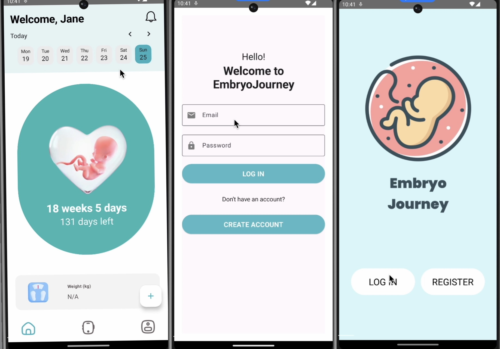

# Embryo Journey App

## Overview

Embryo Journey is a user-friendly mobile application designed to support expectant mothers by providing personalized health content and tools aimed at reducing maternal mortality rates. Our app leverages modern technologies to ensure efficiency, scalability, and security in handling sensitive health data.




## Key Features

- **User Authentication**: Secure registration and login processes.
- **Personalized Health Content**: Integrates Gemini AI for tailored advice and a chatbot feature.
- **Progress Tracking**: Allows users to monitor their pregnancy journey effectively.
- **Health Data Management**: Secure storage and retrieval of user health data.

## Technology Stack

- **Frontend**: Developed using **Kotlin** for seamless integration with Android devices, ensuring a smooth user experience.
- **Backend**: Utilizes **FastAPI**, a lightweight and efficient framework, for handling data with minimal resource usage.
- **Database**: Implements **PostgreSQL** for reliable and secure data storage, capable of scaling with user demand.
- **Cloud Deployment**: Deployed on **Google Cloud**, benefiting from managed services that reduce overhead and facilitate scaling while ensuring compliance with security standards.

## Feasibility and Scalability

Our app is highly feasible due to:

- **Cost-Effective Technologies**: Using proven, modern technologies that are both affordable and scalable.
- **Modular Architecture**: The app's design allows for straightforward updates and maintenance, ensuring long-term sustainability and adaptability to future needs.
- **Security Compliance**: The platform ensures the protection of sensitive health data, aligning with industry security standards.

## Getting Started

To set up and run the Embryo Journey application, follow these steps:

### Prerequisites

1. **Install Docker**:  
   Download and install Docker from the [Docker official website](https://www.docker.com/products/docker-desktop).

### Step-by-Step Installation

1. **Open the Repository**:  
   Launch your preferred IDE and open the Embryo Journey project repository.


2. **Install Python Dependencies**:  

   Ensure your terminal is in the directory containing `requirements.txt`, then run:
   ```bash
   pip install -r requirements.txt
   
4. **Run Docker**:

   Navigate to the directory containing the `docker-compose.yaml` file. Execute the following command to start the application with Docker:
    ```bash
    docker-compose up -d

6. **Run Database Migration**:

   After Docker is up and running, apply the database migrations using Alembic:
    ```bash
    alembic upgrade head

8. **Start the Application**:

   Before starting the FastAPI application, ensure your terminal is in the directory where main.py is located. Then execute:
    ```bash
    uvicorn main:app --reload


